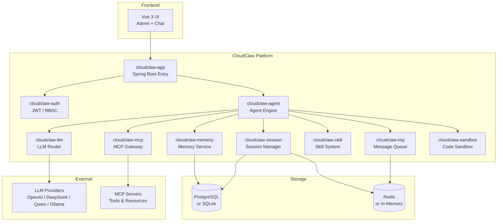

<div align="center">

# ☁️🐾 CloudClaw

**Enterprise-grade Open Source AI Agent Platform**

*Build, deploy, and scale AI Agents with Spring Boot & Spring AI*

[](https://www.oracle.com/java/)
[](https://spring.io/projects/spring-boot)
[](https://spring.io/projects/spring-ai)
[](LICENSE)
[](https://github.com/cloudclaw-dev/cloudclaw/releases/tag/v1.0.0)

[English](#features) · [中文](#-核心特性) · [Quick Start](#-quick-start) · [Documentation](#-architecture)

</div>

---

## 🌟 Why CloudClaw

Most AI Agent platforms target individual developers — local filesystems, single-user, stateful processes. **Enterprises need more**: multi-tenant isolation, stateless scalability, and a secure Agent runtime.

CloudClaw makes AI Agent platforms **as easy to deploy as any regular Java app**:

- 🚀 **`java -jar` to start** — Standalone mode with zero external dependencies
- 👥 **Multi-tenant by design** — Sessions, memories, and configs isolated per user
- ⚡ **Stateless Agents** — All state in databases and caches, ready for horizontal scaling
- 🔒 **Security first** — Agent I/O through MCP, database, or isolated sandbox
- 🧩 **Pluggable everything** — Memory engines, MQ, LLM providers, MCP servers — all replaceable

## ✨ Features

<table>
<tr>
<td width="50%">

### 🤖 Agent Management
- Multi-Agent with independent configs
- Prompt template assembly
- Streaming chat (SSE) + async fallback
- Session persistence & context caching

</td>
<td width="50%">

### 🔧 MCP Gateway
- Built-in MCP protocol gateway
- Connection pooling
- Tool routing & permission control
- Auto-discovery via `@Tool`

</td>
</tr>
<tr>
<td>

### 🧠 Memory Service
- Pluggable engines: JDBC / Mem0
- Vector search support
- Long-term & short-term memory
- Per-session isolation

</td>
<td>

### 🔐 Auth & RBAC
- JWT authentication
- Admin / User role separation
- Token encryption for API keys
- Access & refresh token rotation

</td>
</tr>
<tr>
<td>

### 🔒 Sandbox Execution
- Python / JS / Shell / Java
- Local, Docker, E2B backends
- Stateless & Session modes
- Configurable timeout & limits

</td>
</tr>
<tr>
<td>

### 📊 Monitoring & UI
- Vue 3 dual UI (Admin + Chat)
- Element Plus + ECharts
- Usage stats & prompt logs
- Mobile-responsive design

</td>
</tr>
</table>

## 🏗 Architecture



## 🚀 Quick Start

### Option 1: Standalone Mode (Zero Dependencies)

```bash
# Download from GitHub Releases
wget https://github.com/cloudclaw-dev/cloudclaw/releases/download/v1.0.0/cloudclaw-1.0.0-release.zip
unzip cloudclaw-1.0.0-release.zip

# Start
chmod +x start.sh
./start.sh

# Access http://localhost:8080
# Default login: admin / admin123
```

### Option 2: Build from Source

```bash
git clone https://github.com/cloudclaw-dev/cloudclaw.git
cd cloudclaw
mvn clean package -DskipTests
java -jar cloudclaw-app/target/cloudclaw-app-1.0.0.jar
```

### Option 3: Docker Compose

```bash
# Standalone
docker compose -f docker-compose.standalone.yml up -d

# Cluster (PostgreSQL + Redis)
docker compose -f docker-compose.yml up -d
```

### After Login

Go to **LLM 管理** to configure your API key and model provider. Supports OpenAI, DeepSeek, Qwen, GLM, Ollama, and any OpenAI-compatible API.

## 🆚 CloudClaw vs OpenClaw

| | [OpenClaw](https://github.com/openclaw/openclaw) | CloudClaw |
|------|----------|-----------|
| **Target** | Personal AI assistant | Enterprise AI Agent platform |
| **Language** | Node.js / TypeScript | Java (Spring Boot) |
| **Users** | Single user | Multi-tenant with data isolation |
| **Storage** | Local filesystem (MEMORY.md) | Database (PostgreSQL / SQLite) |
| **Script Execution** | Local Shell / PTY | Isolated Sandbox (Docker / E2B) |
| **Agent State** | Stateful (local process) | Stateless, horizontally scalable |
| **Memory** | Local Markdown files | Database-backed (JDBC / Mem0) |
| **Frontend** | None (third-party integrations) | Vue 3 + Element Plus (Admin + Chat) |
| **Deployment** | Personal devices | Server / Container / K8s |
| **License** | MIT | Apache 2.0 |

> **OpenClaw is your personal butler. CloudClaw is your enterprise Agent middleware.**

## 📦 Deployment Modes

| Mode | Database | MQ | Cache | Best For |
|------|----------|----|-------|----------|
| **Standalone** | SQLite | In-Memory | Caffeine | Dev, testing, personal use |
| **Cluster** | PostgreSQL | Redis Streams | Redis | Production, horizontal scaling |

## ⚙️ Configuration

| Property | Default | Description |
|----------|---------|-------------|
| `spring.profiles.active` | `standalone` | `standalone` or `cluster` |
| `cloudclaw.jwt.secret` | (built-in) | JWT signing key (**change in production!**) |
| `cloudclaw.memory.engine` | `jdbc` | Memory engine: `jdbc` or `mem0` |
| `cloudclaw.mq.provider` | `inmemory` | MQ provider: `inmemory` or `redis` |
| `cloudclaw.sandbox.default-backend` | `LOCAL` | Sandbox: `LOCAL`, `DOCKER`, `E2B` |
| `cloudclaw.sandbox.default-timeout` | `30s` | Code execution timeout |

See [CONTRIBUTING.md](CONTRIBUTING.md) for development setup.

## 🛠 Tech Stack

| Layer | Technology |
|-------|-----------|
| **Runtime** | Java 17, Spring Boot 3.4.5 |
| **AI Framework** | Spring AI 1.1.5 |
| **Database** | PostgreSQL 16 / SQLite |
| **Cache & MQ** | Redis 7 / Caffeine / In-Memory |
| **Auth** | JWT + Spring Security |
| **Migration** | Flyway |
| **Sandbox** | agent-sandbox-core, Docker (Testcontainers), E2B |
| **Frontend** | Vue 3, Element Plus, Vite, TypeScript, ECharts |

## 📄 License

[Apache License 2.0](LICENSE)

---

<div align="center">

**[⬆ Back to Top](#-cloudclaw)**

Made with ❤️ by the CloudClaw Team

</div>
