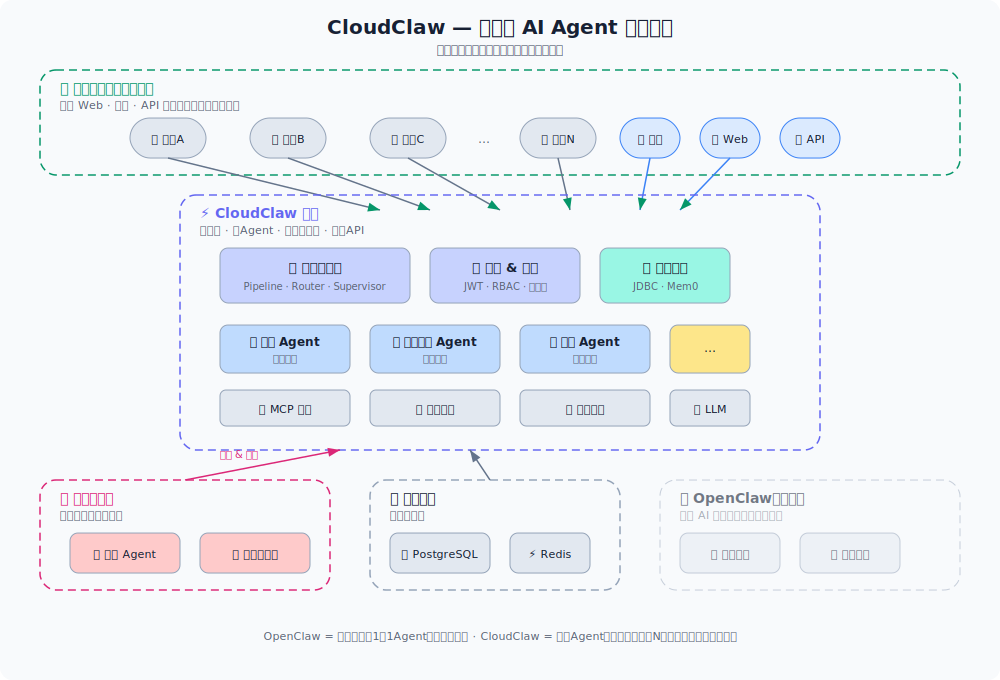

<div align="center">

# CloudClaw

**企业级开源 AI Agent 平台**

基于 Spring Boot · Spring AI · Vue 3 构建

[](LICENSE)
[](https://openjdk.org/projects/jdk/17/)
[](https://spring.io/projects/spring-boot)

[🌐 官网](https://cloudclaw.run) · [📖 文档](https://cloudclaw.run) · [💬 讨论](https://github.com/cloudclaw-dev/cloudclaw/discussions) · [🐛 问题](https://github.com/cloudclaw-dev/cloudclaw/issues)

**[English](README.md)** · **中文**

</div>

---

大多数 AI Agent 平台面向个人开发者——本地文件系统、脚本执行、单用户。企业需要更多：**多租户隔离、无状态可扩展、安全的 Agent 运行时**。

CloudClaw 是一个企业级 AI Agent 平台，让部署多 Agent 系统像运行普通 Web 应用一样简单。

## ✨ 核心特性

- 🚀 **一行命令启动** — Standalone 模式 `java -jar` 即可，生产环境用 Docker Compose
- 👥 **多租户设计** — 会话、记忆、配置按用户隔离
- 📈 **无状态可扩展** — 所有状态存储在数据库和缓存中，支持水平扩展
- 🔒 **安全优先** — Agent 通过 MCP、数据库或隔离沙箱交互，绝不直接访问宿主机
- 🔌 **全插件化** — 记忆引擎、消息队列、LLM 提供商、MCP 服务器均可替换
- 🤖 **5 种编排模式** — 内置 Pipeline、Parallel、Router、Supervisor、Handoff


## 🏗️ 架构总览

<div align="center">
  
</div>

> 企业开发者在 CloudClaw 上构建数字员工（Agent），然后全体员工以服务的方式使用。


## 🎯 CloudClaw vs OpenClaw

CloudClaw 和 [OpenClaw](https://github.com/openclaw/openclaw) 是互补项目：

| | OpenClaw | CloudClaw |
|------|----------|-----------|
| **定位** | 个人 AI 助手 | 企业级 AI Agent 平台 |
| **语言** | Node.js / TypeScript | Java (Spring Boot) |
| **用户** | 单用户 | 多租户，数据隔离 |
| **存储** | 本地文件系统 (MEMORY.md) | 数据库 (PostgreSQL / SQLite) |
| **脚本执行** | 本地 Shell / PTY | 隔离沙箱 (Local/Docker/E2B) |
| **Agent 状态** | 有状态（本地进程） | 无状态，支持水平扩展 |
| **记忆** | 本地 Markdown 文件 | 数据库驱动 (JDBC / Mem0 / Zep) |
| **AI 框架** | 自研 | Spring AI |
| **前端** | 无（第三方集成） | Vue 3 + Element Plus（管理端 + 对话端） |
| **部署** | 个人设备 | 服务器 / 容器 / K8s |
| **协议** | MIT | Apache 2.0 |

> **OpenClaw 是你的私人管家，CloudClaw 是你的企业 Agent 中间件。**

## 🚀 快速开始

### Standalone 模式（零依赖）

```bash
# 克隆
git clone https://github.com/cloudclaw-dev/cloudclaw.git
cd cloudclaw

# 构建
mvn clean package -DskipTests

# 设置必需的密钥
export JWT_SECRET="your-secret-key-at-least-32-bytes-long!!"
export CRYPTO_SECRET="your-crypto-secret-key-at-least-32b"

# 启动
java -jar cloudclaw-app/target/cloudclaw-app-1.0.6.jar
```

打开 http://localhost:8080/，使用 `admin / admin123` 登录。

开箱即用——SQLite + 内存消息队列，无需任何外部依赖。

> ⚠️ `JWT_SECRET` 和 `CRYPTO_SECRET` 是**必填项**，生产环境请使用强随机字符串。

### Cluster 模式（PostgreSQL + Redis）

```bash
# 前置条件：PostgreSQL 16+ 和 Redis 7+

createdb cloudclaw

mvn clean package -DskipTests

export JWT_SECRET="your-secret-key-at-least-32-bytes-long!!"
export CRYPTO_SECRET="your-crypto-secret-key-at-least-32b"

java -jar cloudclaw-app/target/cloudclaw-app-1.0.6.jar \
  --spring.profiles.active=cluster
```

配置 `application-cluster.yml`：

```yaml
spring:
  datasource:
    url: jdbc:postgresql://localhost:5432/cloudclaw
    username: postgres
    password: your-password
  data:
    redis:
      host: localhost
      port: 6379
```

## 🤖 多 Agent 工作流

内置 5 种多 Agent 协作编排模式：

| 模式 | 说明 |
|------|------|
| **Pipeline** | 顺序执行——上游输出作为下游输入 |
| **Parallel** | 多个 Agent 并行执行，结果合并（拼接或 LLM 总结） |
| **Router** | 基于 LLM 的意图分类，路由到最匹配的子 Agent |
| **Supervisor** | 规划/审查 Agent 迭代式地向专业子 Agent 分发任务 |
| **Handoff** | 对话在 Agent 之间传递，各 Agent 维护独立上下文 |

每种模式均支持按节点配置模型、系统提示词、MCP 服务器和技能。

## 📂 模块结构

```
cloudclaw
├── cloudclaw-app          # Spring Boot 启动模块 & 配置
├── cloudclaw-common       # 公共模型、DTO、工具类
├── cloudclaw-auth         # JWT 认证 & 授权
├── cloudclaw-agent        # Agent 引擎、提示词组装、对话编排、工作流
├── cloudclaw-llm          # LLM 多提供商路由、凭据加密、用量统计
├── cloudclaw-mcp          # MCP 网关、连接池、工具路由
├── cloudclaw-memory       # 记忆服务（JDBC / Mem0 引擎）
├── cloudclaw-session      # 会话 & 消息持久化
├── cloudclaw-skill        # 技能定义 & 管理
├── cloudclaw-mq           # 消息队列抽象（Redis Streams / 内存）
├── cloudclaw-admin        # 管理 API 控制器
├── cloudclaw-user         # 用户端 API 控制器
├── cloudclaw-sandbox      # 代码沙箱（Local/Docker/E2B）
├── cloudclaw-standalone   # Standalone 模式（SQLite、内存 MQ、Caffeine 缓存）
├── cloudclaw-debug        # 调试工具（可选，禁用时零开销）
├── cloudclaw-release      # 分发包打包（脚本、Assembly）
└── cloudclaw-ui           # Vue.js 前端（Chat + Admin 统一 SPA）
```

## 📦 技术栈

| 层级 | 技术 |
|------|------|
| **后端** | Java 17, Spring Boot 3.4.5, Spring AI 1.1.5 |
| **数据库** | PostgreSQL 16 / SQLite |
| **缓存** | Redis 7 |
| **消息队列** | Redis Streams |
| **认证** | JWT (HS384) |
| **数据库迁移** | Flyway |
| **沙箱** | Local / Docker (Testcontainers) / E2B |
| **前端** | Vue 3, Element Plus, Vite, TypeScript, ECharts |
| **AI 模型** | Spring AI — OpenAI 兼容协议（DeepSeek / Qwen / GLM / Ollama / …） |

## ⚙️ 配置项

| 配置 | 默认值 | 说明 |
|------|--------|------|
| `spring.profiles.active` | `standalone` | `standalone` 或 `cluster` |
| `cloudclaw.jwt.secret` | *(必填)* | JWT 签名密钥（环境变量：`JWT_SECRET`） |
| `cloudclaw.jwt.access-token-ttl` | `2h` | Access Token 有效期 |
| `cloudclaw.jwt.refresh-token-ttl` | `7d` | Refresh Token 有效期 |
| `cloudclaw.crypto.secret` | *(必填)* | 加密密钥（环境变量：`CRYPTO_SECRET`） |
| `cloudclaw.memory.engine` | `jdbc` | 记忆引擎：`jdbc` 或 `mem0` |
| `cloudclaw.mq.provider` | `inmemory` | 消息队列：`inmemory` 或 `redis` |
| `cloudclaw.mcp.pool.max-connections-per-server` | `5` | 每个 MCP 服务器最大连接数 |
| `cloudclaw.sandbox.default-backend` | `LOCAL` | 沙箱后端：`LOCAL`、`DOCKER`、`E2B` |
| `cloudclaw.sandbox.default-mode` | `STATELESS` | 沙箱模式：`STATELESS` 或 `SESSION` |
| `cloudclaw.sandbox.default-timeout` | `30s` | 默认执行超时 |
| `cloudclaw.sandbox.max-timeout` | `5m` | 最大执行超时 |

## 🤝 参与贡献

欢迎贡献代码！请随时提交 Pull Request。

1. Fork 本仓库
2. 创建特性分支 (`git checkout -b feature/amazing-feature`)
3. 提交修改 (`git commit -m 'Add amazing feature'`)
4. 推送到分支 (`git push origin feature/amazing-feature`)
5. 发起 Pull Request

## 📄 许可证

[Apache License 2.0](LICENSE)

---

<div align="center">

**[⬆ 回到顶部](#cloudclaw)**

</div>
